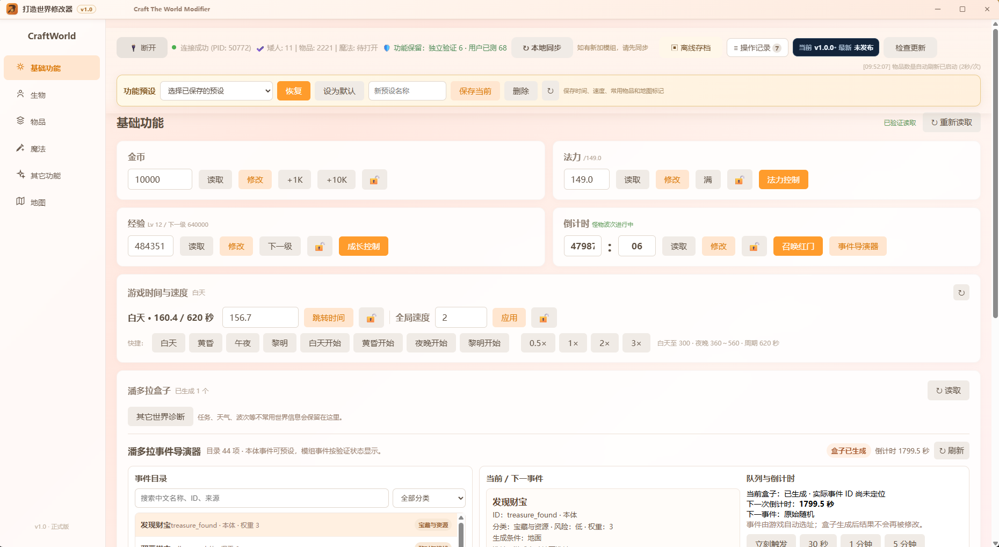

# 打造世界修改器 · CraftWorld Modifier

面向 Windows 与 Steam 版 **Craft The World / 打造世界** 的本地桌面修改器。

它把资源、成长、生物、物品、魔法、地图与世界事件整理到同一个界面中；读取结果会明确区分未连接、当前存档无数据、版本不支持和定位失效，写入操作尽量经过对象校验、即时读回与游戏内确认。

> 当前正式版本：**v1.1**。
>
> **务必使用 Steam 最新版，或 [1.11.009](https://steamdb.info/patchnotes/21203273/) 及以上的版本。使用更低版本时，部分功能或许仍然有效；务必提前备份存档，若发生游戏崩溃致使存档损坏，本项目概不负责。**

[⬇️ 下载 v1.1（Windows EXE）](https://github.com/dszwamn/CraftWorldModifier/releases/download/v1.1/CraftWorldModifier.exe) · [校验 SHA-256](https://github.com/dszwamn/CraftWorldModifier/releases/download/v1.1/SHA256SUMS.txt) · [查看全部 Release](../../releases)



## 兼容性速览

| 游戏环境 | 预期支持情况 | 使用建议 |
| --- | --- | --- |
| Steam 最新版 / 1.11.009 及以上 | 推荐范围 | 先读取确认，再进行单次写入。 |
| 接近的 Steam 旧版本 | 部分功能可能可用 | 不要把“可读取”视为“全部可写入”。 |
| 非 Steam、重打包或测试版本 | 不保证兼容 | 仅建议在副本存档中测试。 |
| 安装或移除模组后 | 对象定位可能改变 | 重新连接并做读取检查。 |

## 功能概览

| 模块 | 可用内容 |
| --- | --- |
| 基础功能 | 金币、法力、经验、游戏时间与速度，以及红门倒计时和事件控制。 |
| 世界事件 | 潘多拉盒子目录、下一事件安排、倒计时和队列。 |
| 生物 | 矮人与已识别生物的列表、状态、坐标读取、培养与装备设置、矮人生成。 |
| 物品与配方 | 物品目录、数量读取与已验证修改、配方编辑。 |
| 魔法与地图 | 常用魔法参数、地图读取、标记与已验证的地图编辑工具。 |
| 存档与记录 | 离线存档备份/校验/恢复入口，以及本次会话的操作记录和可撤销项目。 |

功能会因游戏版本、存档状态和模组而变化。界面显示“定位失效”“版本不支持”或“游戏未确认该操作”时，应把它视为未成功，而不是继续重复写入。

功能仅在游戏运行时使用；不会上传存档、游戏目录或个人配置。

## 快速开始

1. 前往仓库的 [Releases](../../releases) 下载 `CraftWorldModifier.exe`。
2. 启动游戏并进入存档，再运行修改器。
3. 点击“连接游戏”，先确认基础读数正确。
4. 第一次修改请使用副本存档，并从单次、小范围操作开始。

个人设置保存在：

`%LOCALAPPDATA%\CraftWorldModifier\config\user_data.json`

因此替换或更新 EXE 不会覆盖地图标记、分类和其它个人设置。

## 更新方式

- 启动后会在后台读取一次 GitHub 最新 Release，仅更新顶部版本提示；不会自动下载或替换文件。
- 点击顶部版本信息可以打开更新中心，手动检查、下载并校验新版本。
- 应用更新前会校验文件大小与 SHA-256；下载失败或校验不通过时不会替换正在使用的 EXE。

## 从源码运行

环境：Windows 10/11、Python 3.10+、Steam 版游戏。

```powershell
python -m pip install -r requirements.txt
python .\craft_web_v1.0.py
```

## 构建单文件 EXE

安装构建依赖后运行：

```powershell
python -m pip install -r requirements-build.txt
powershell -ExecutionPolicy Bypass -File .\build_release.ps1
```

输出文件为 `发布包\CraftWorldModifier.exe` 与 `发布包\SHA256SUMS.txt`。它会把界面、默认配置、方块数据与物品翻译数据打入一个 EXE；个人配置不会参与构建。

## 目录说明

- `craft_web_v1.0.py`：Python 后端、游戏读取/写入与更新逻辑。
- `ui_v1.0.html`：桌面界面。
- `block_data.py`、`item_translations.txt`：随程序读取的方块和名称数据。
- `config/marks.json`：不含个人数据的默认配置模板。
- `build_release.ps1`：构建单文件 EXE 的脚本。
- `docs/images/main-panel.png`：主界面截图。

## 兼容性与安全提示

- 务必优先使用 Steam 最新版，或 [1.11.009](https://steamdb.info/patchnotes/21203273/) 及以上版本；非 Steam 版本、旧版本、测试版、重新打包版或不同语言/模组组合可能存在地址和对象结构差异。
- 低于上述版本时，个别功能可能仍可用，但不代表整体兼容；不要把旧版本定位结果直接套用到更新后的游戏，也不要在版本不明时强行执行写入。
- 第一次使用、游戏刚更新、安装或移除模组后，先连接并只做读取检查；确认读数准确后，再在副本存档上进行单次、小范围写入。
- 如果出现定位失败、版本不支持、读回不一致、游戏卡顿、异常贴图或崩溃征兆，请立即停止写入，关闭修改器并重新启动游戏；不要连续重复执行同一操作。
- 红门、潘多拉、生物生成、地图编辑、配方和装备等会改变世界状态的功能风险更高，务必先保存或备份存档，并在确认游戏稳定后再继续。
- 修改器只保证“已验证的 Steam 版本”范围内的行为；第三方修改器、注入器、调试器或其它内存工具同时运行时，无法保证兼容性。
- 游戏或模组更新后，先在副本存档上确认读取和写入是否仍正常。
- 看到“定位失效”“版本不支持”或“游戏未确认该操作”时，不要把显示值当作实际写入结果。
- 对会改变世界、物品或生物的数据，优先使用操作记录中的已验证撤销项；重要存档请先使用“离线存档”备份。

本项目不保证游戏或存档不会因版本差异、模组、第三方工具或不当操作而受损；重要存档请始终保留独立备份。

## 反馈问题

提交问题前，请尽量附上以下信息，便于判断是兼容性问题还是定位失效：

- 游戏版本、Steam/非 Steam 来源、是否安装模组；
- 修改器版本与具体操作步骤；
- 操作前后的界面读数、操作记录截图；
- 如发生崩溃，附上游戏生成的崩溃报告文件名。

请不要上传完整存档、个人路径、Token 或任何私密信息。

## 授权与再发布

本项目采用保留所有权利的授权策略；请参阅 [LICENSE](LICENSE)。游戏本体、模组、名称、图标及其相关数据仍归各自权利人所有，本项目与游戏开发商或发行平台不存在官方关联。
